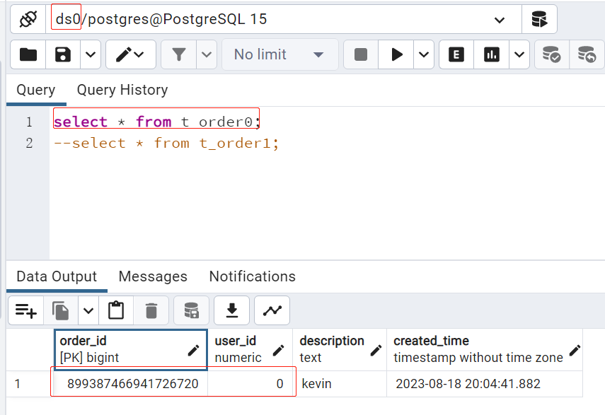
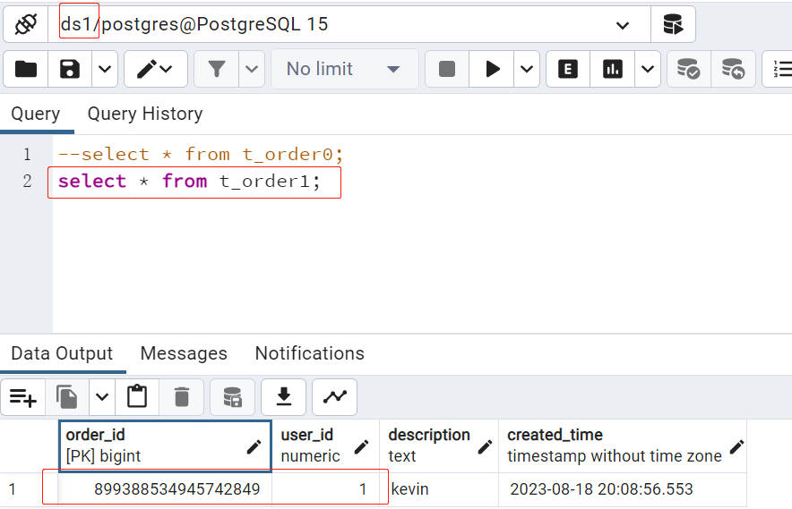

## Setup a completed distributed system.

### Features:
- Gateway
- Circuit Breaker/Degrade
- Configuration/Register Center
- Database Sharding
- Distribution transaction
- 
### Implementation
- Springcloud Gateway
- Sentinel
- Nacos
- Apache Shardingsphere
- Seata

### Monitoring
- Zipkin
- Promethenus
- Grafana

### Preparation

*please reference with [`springcloud-ali`](./springcloud-ali) module to see how to use k8s+istio setup all modules.*

### Code
- Use `nacos.kevin.com:80` as nacors server-addr (`spring.cloud.nacos.*.server-addr`)
- Use `seata.kevin.com:31400` as seata group list(`*.grouplist`).

### Major Configurations
- Gateway Configuration.
```agsl
spring:
  cloud:
    gateway:
      discovery:
        locator:
          enabled: true # if set it as true, it will generate all services that already registered in nacos
          lowerCaseServiceId: true
      routes:
        - id: shopping
          uri: lb://shopping 
          predicates:
            - Path=/**
```

- Circuit Breaker Configuration.
```agsl
[
  {
    "resource": "shopping_group_prefix",
    "count": 10,
    "grade":1,
    "resourceMode":1
  }
]
```

- Shardingsphere configuration.
```agsl
spring:
  shardingsphere:
    mode:
      type: Memory
    props:
      show-sql: true
    datasource:
      names: ds0,ds1
      ds0:
        type: com.zaxxer.hikari.HikariDataSource
        url: jdbc:postgresql://localhost:5432/ds0
        username: postgres
        password: postgres
      ds1:
        type: com.zaxxer.hikari.HikariDataSource
        url: jdbc:postgresql://localhost:5432/ds1
        username: postgres
        password: postgres
    rules:
      sharding:
        tables:
          t_order:
            actual-data-nodes: ds${0..1}.t_order${0..1}
            database-strategy:
              standard:
                sharding-column: user_id
                sharding-algorithm-name: databaseInline
            table-strategy:
              standard:
                sharding-column: order_id
                sharding-algorithm-name: orderInline
            key-generate-strategy:
              column: order_id
              key-generator-name: snowflake
        sharding-algorithms:
          databaseInline:
            type: INLINE
            props:
              algorithm-expression: ds${user_id % 2}
          orderInline:
            type: INLINE
            props:
              algorithm-expression: t_order${order_id % 2}
        keyGenerators:
          snowflake:
            type: SNOWFLAKE
```

- Seata Configuration.
```agsl
seata:
  enabled: true
  application-id: shopping
  tx-service-group: shopping-group
  service:
    vgroup-mapping:
      shopping-group: shopping-group
    shopping-group:
      grouplist: seata.kevin.com:31400
    enableDegrade: false
    disable: false
```

### Key stuffs
- Springcloud gateway only support web-flux, and use netty by default, it use NIO and improve system performance.
- There are some difference between use shardingsphere+seata and seata, if use shardingsphere+seata, you still need add seata.conf in your project.
- Pass through transactionId to downstream services, don't add `Transacational`.

### Modules
*The project use module management, modules declared in `springcloud-ali` project*

- **springcloud-ali**: declare dependencies versions and declare children modules.
- **common**: include codes that used across different modules.
- **domain**: include domain objects.
- **gateway-sample**: declare api rules and circuit/degrade rules, all configurations managed by Nacos, `resources` contains backup configurations.
- **shopping**: a micro service mock an integration service that will call `order` service and `inventory` service.
- **order**: a micro service mock order service, provide a `POST` api that used to create a order.
- **inventory**: a micro service mock inventory service, provide a `PUT` api that used to update `pcs`.

### WORKFLOW
1. Call shopping service using api gateway.
2. Create an order.
3. Update inventory.

### Cases
- Sharding database/tables.
    *Use `snowflake` as key generator, `user_id` as db sharding key, `order_id` as table sharding key*
    
    1. Call shopping service use api gateway url.
```agsl
      curl --location 'http://localhost:7999/shopping/shopping' \
      --header 'Content-Type: application/json' \
      --data '{
      "order": {
      "userId": 0,
      "description": "kevin"
      },
      "inventoryId": "899352334096662528",
      "pcs": 88
      }'  
```

  
  2. Call shopping service use api gateway url.
```agsl
     curl --location 'http://localhost:7999/shopping/shopping' \
    --header 'Content-Type: application/json' \
    --data '{
    "order": {
    "userId": 1,
    "description": "kevin"
    },
    "inventoryId": "899352334096662528",
    "pcs": 88
    }'
```


- Distributed Transaction
*Total 2 orders in database, and "inventoryId": 899352334096662528's pcs is 88*
    1. Create a new order and set pcs as 87.
```agsl
  curl --location 'http://localhost:7999/shopping/shopping' \
    --header 'Content-Type: application/json' \
    --data '{
    "order": {
    "userId": 1,
    "description": "kevin"
    },
    "inventoryId": "899352334096662528",
    "pcs": 87
    }'
```
you will see logs, both services show `PhaseTwo_Commited`, and there are 3 orders in database and inventory's pcs updated to 87.

**Logs in Order service**
```agsl
2023-08-18 20:15:20.410  INFO 33420 --- [h_RMROLE_1_7_32] i.s.c.r.p.c.RmBranchCommitProcessor      : rm client handle branch commit process:BranchCommitRequest{xid='10.1.3.174:8091:3288053320901810289', branchId=3288053320901810291, branchType=AT, resourceId='jdbc:postgresql://localhost:5432/ds1', applicationData='null'}
2023-08-18 20:15:20.410  INFO 33420 --- [h_RMROLE_1_7_32] io.seata.rm.AbstractRMHandler            : Branch committing: 10.1.3.174:8091:3288053320901810289 3288053320901810291 jdbc:postgresql://localhost:5432/ds1 null
2023-08-18 20:15:20.410  INFO 33420 --- [h_RMROLE_1_7_32] io.seata.rm.AbstractRMHandler            : Branch commit result: PhaseTwo_Committed
```
**Logs in Inventory service**
```agsl
2023-08-18 20:15:20.104  INFO 14308 --- [nio-7002-exec-8] io.seata.rm.AbstractResourceManager      : branch register success, xid:10.1.3.174:8091:3288053320901810289, branchId:3288053320901810293, lockKeys:t_inventory0:899352334096662528
2023-08-18 20:15:20.112  INFO 14308 --- [nio-7002-exec-8] c.k.s.c.interceptor.SeataXidInterceptor  : 10.1.3.174:8091:3288053320901810289 unbind in http-nio-7002-exec-8
2023-08-18 20:15:20.420  INFO 14308 --- [_RMROLE_1_10_32] i.s.c.r.p.c.RmBranchCommitProcessor      : rm client handle branch commit process:BranchCommitRequest{xid='10.1.3.174:8091:3288053320901810289', branchId=3288053320901810293, branchType=AT, resourceId='jdbc:postgresql://localhost:5432/ds0', applicationData='null'}
2023-08-18 20:15:20.420  INFO 14308 --- [_RMROLE_1_10_32] io.seata.rm.AbstractRMHandler            : Branch committing: 10.1.3.174:8091:3288053320901810289 3288053320901810293 jdbc:postgresql://localhost:5432/ds0 null
2023-08-18 20:15:20.420  INFO 14308 --- [_RMROLE_1_10_32] io.seata.rm.AbstractRMHandler            : Branch commit result: PhaseTwo_Committed
```
2. assume inventory service unavailable, just stop it, then call again.

there are still 3 orders in database.

**Logs in Order service**, you should see it already rollback.
```agsl
2023-08-18 20:23:09.184  INFO 33420 --- [nio-7000-exec-6] c.k.s.c.interceptor.SeataXidInterceptor  : 10.1.3.174:8091:3288053320901810296 unbind in http-nio-7000-exec-6
2023-08-18 20:23:09.312  INFO 33420 --- [h_RMROLE_1_8_32] i.s.c.r.p.c.RmBranchRollbackProcessor    : rm handle branch rollback process:BranchRollbackRequest{xid='10.1.3.174:8091:3288053320901810296', branchId=3288053320901810298, branchType=AT, resourceId='jdbc:postgresql://localhost:5432/ds1', applicationData='null'}
2023-08-18 20:23:09.332  INFO 33420 --- [h_RMROLE_1_8_32] io.seata.rm.AbstractRMHandler            : Branch Rollbacking: 10.1.3.174:8091:3288053320901810296 3288053320901810298 jdbc:postgresql://localhost:5432/ds1
2023-08-18 20:23:09.691  INFO 33420 --- [h_RMROLE_1_8_32] i.s.r.d.undo.AbstractUndoLogManager      : xid 10.1.3.174:8091:3288053320901810296 branch 3288053320901810298, undo_log deleted with GlobalFinished
2023-08-18 20:23:09.691  INFO 33420 --- [h_RMROLE_1_8_32] i.seata.rm.datasource.DataSourceManager  : branch rollback success, xid:10.1.3.174:8091:3288053320901810296, branchId:3288053320901810298
2023-08-18 20:23:09.692  INFO 33420 --- [h_RMROLE_1_8_32] io.seata.rm.AbstractRMHandler            : Branch Rollbacked result: PhaseTwo_Rollbacked
```


      
    
